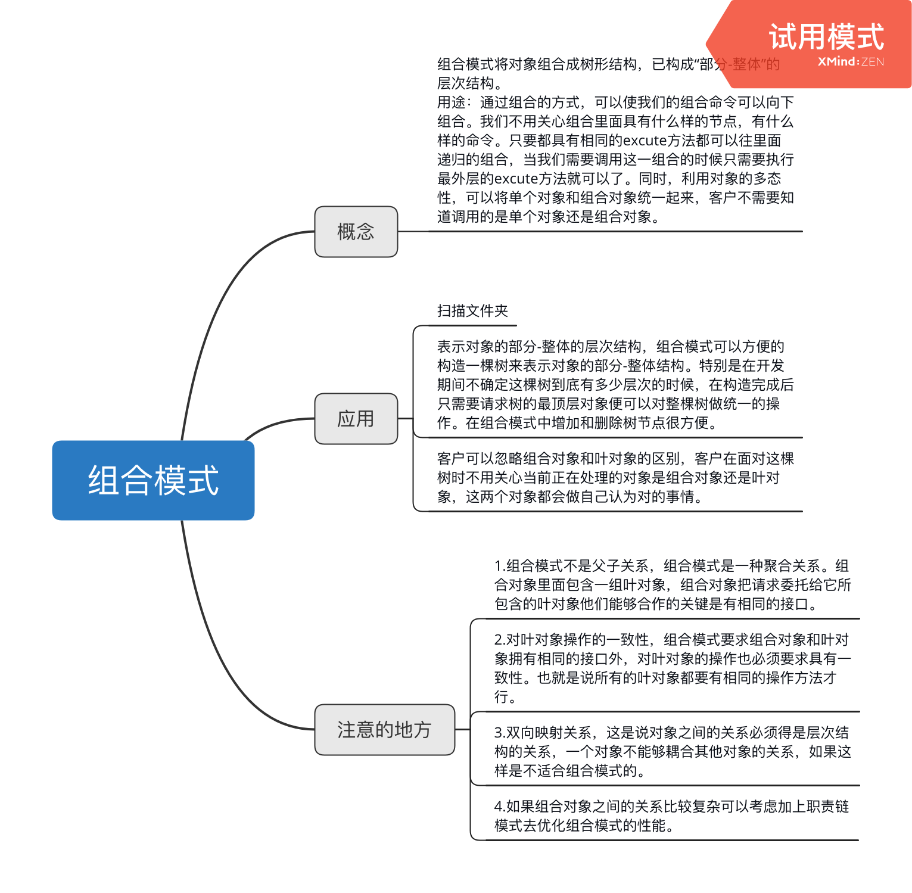

# 组合模式
组合模式将对象组合成树形结构，已构成“部分-整体”的层次结构。
> 用途：通过组合的方式，可以使我们的组合命令可以向下组合。我们不用关心组合里面具有什么样的节点，有什么样的命令。只要都具有相同的excute方法都可以往里面递归的组合，当我们需要调用这一组合的时候只需要执行最外层的excute方法就可以了。同时，利用对象的多态性，可以将单个对象和组合对象统一起来，客户不需要知道调用的是单个对象还是组合对象。

一个请求在组合对象树中的传递，可以由顶层节点不断向下传递。

## 透明性带来的安全性问题
正如可以往组合对象里面叠加新的节点的情况一样。只有往组合对象里面才能添加叶节点，叶对象里面不能够添加叶对象，为了避免这种情况只有先人为的add方法里面添加判断情况。

```typescript

interface ICommandObject {
    execute: () => any;
}

interface IMacroCommand {
    commandList: Array<any>;
    add: (command: ICommandObject) => any;
    execute: () => any;
}

class BetterMacroCommand implements IMacroCommand {
    commandList = [];

    add(command) {
        this.commandList.push(command);
    }
    execute() {
        for(let i = 0,command;command = this.commandList[i++];) {
            command.execute();
        }
    } 
}

const betterMacroCommand1 = new BetterMacroCommand;
const betterMacroCommand2 = new BetterMacroCommand;
const betterMacroCommand3 = new BetterMacroCommand;

const openAcCommand = {
    execute: function() {
        console.log('打开空调');
    }
}

//由于电视和音响是连在一起的，所以可以构建一个宏命令来组合打开电视和打开音响
const openTvCommand = {
    execute: function() {
        console.log('打开电视');
    },
    add: function() {
        throw new Error('叶对象里面不能再添加叶对象');
    }
}

const openSoundCommand = {
    execute: function() {
        console.log('打开音响');
    },
    add: function() {
        throw new Error('叶对象里面不能再添加叶对象');
    }
}
betterMacroCommand1.add(openAcCommand);
betterMacroCommand1.add(openTvCommand);
betterMacroCommand1.add(openSoundCommand);

const closeDoorCommand = {
    execute: function() {
        console.log('关门');
    },
    add: function() {
        throw new Error('叶对象里面不能再添加叶对象');
    }
}

const openPcCommand = {
    execute: function() {
        console.log('开电脑');
    },
    add: function() {
        throw new Error('叶对象里面不能再添加叶对象');
    }
}

const openQQCommand = {
    execute: function() {
        console.log('打开QQ');
    },
    add: function() {
        throw new Error('叶对象里面不能再添加叶对象');
    }
}

betterMacroCommand2.add(closeDoorCommand);
betterMacroCommand2.add(openPcCommand);
betterMacroCommand2.add(openQQCommand);

// 组合所有命令
betterMacroCommand3.add(openTvCommand);
betterMacroCommand3.add(betterMacroCommand1);
betterMacroCommand3.add(betterMacroCommand2);

const setCommand = (function(command) {
    document.getElementById('button').onclick = function() {
        command.execute();
    }
})(betterMacroCommand3)
```

## 扫描文件夹
扫描文件是一个典型的运用。通常我们扫描一个磁盘的文件，里面会包含单独的文件以及文件夹。文件夹则可以看做是组合对象，单个的文件则可以看成是叶对象。首先构造出文件夹对象和叶对象，然后在往里面添加对应的文件。最后只需要执行扫描顶层文件对象的命令，就可以依次扫描文件和文件夹。
```typescript
/* 定义文件夹和文件类 */

interface IFolder {
    name: string;
    files: Array<any>;
}

class Folder implements IFolder {
    name;
    files = [];
    constructor(name) {
        this.name = name;
        this.files = [];
    }

    add(file) {
        this.files.push(file);
    }

    scan() {
        console.log(`开始扫描文件夹` + this.name);
        for(let i = 0,file;file = this.files[i++];) {
            file.scan();
        }
    }
}


class Files{
    name;
    constructor(name) {
        this.name = name;
    }
    add() {
        throw new Error('文件下面不能添加文件夾');
    }
    scan() {
        console.log(`开始扫描文件${this.name}`);
    }
}

// 接下来将文件和文件夹组合成树
const folder = new Folder('学习资料');
const folder1 = new Folder('Javascript');
const folder2 = new Folder('jQuery');

const file1 = new Files('javascript设计模式开发与实践');
const file2 = new Files('精通jquery');
const file3 = new Files('重构与模式');

folder1.add(file1);
folder2.add(file2);

folder.add(folder1);
folder.add(folder2);
folder.add(file3);ssss

// 接下来把移动硬盘里面的文件和文件夹都复制到这棵树中
const folder3 = new Folder('Nodejs');
const file4 = new Files('深入浅出nodejs');
folder3.add(file4);

const file5 = new Files('javascript语言精髓与编程实践');

folder.add(folder3);
folder.add(file5);
```
> 这个例子里面我们改变了树的结构，新增加的文件和文件夹能够很容易的添加到原来的树中，和树里已有的东西一起工作。改变了原来树的结构但是没有修改任何一句源代码，符合开放封闭原则。




