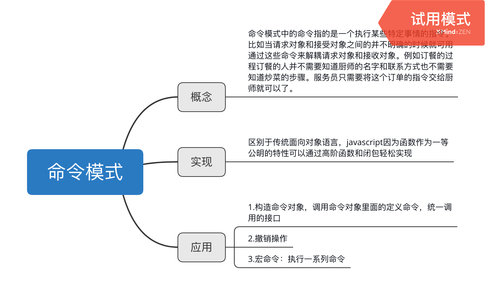

# 命令模式
命令模式中的命令指的是一个执行某些特定事情的指令。比如当请求对象和接受对象之间的并不明确的时候就可用通过这些命令来解耦请求对象和接收对象。例如订餐的过程订餐的人并不需要知道厨师的名字和联系方式也不需要知道炒菜的步骤。服务员只需要将这个订单的指令交给厨师就可以了。                 

## 菜单程序
假如在我们的一个项目开发当中，需要很多的按钮，这些按钮上绑定有相应的点击事件。这个时候开发的方向可以划分成两个，一部分人专门负责画按钮，另一部分人负责编写这些按钮对应的事件。那么在一开始并不知道哪个按钮对应哪个事件，我们只需要使用command对象将这两种关联起来即可。
```typescript
/* 设置安装命令的接口 */

function setCommands(button:HTMLElement, command: any): void{
    button.onclick = function() {
        command.execute();
    }
}

/* 命令方法对象 */

const MenuBar = {
    refresh: () => {
        console.log('刷新菜单目录');
    }
}

const SubMenu = {
    add: () => {
        console.log('增加子菜单');
    },
    del: () => {
        console.log('删除子菜单');
    }
}

interface IRefresh {
    refresh: () => void;
}

interface IAddSub {
    add: () => void;
}

interface IDel {
    del: () => void;
}

// 构造各自的命令类
class RefreshMenuBarCommand {
    constructor(readonly receive: IRefresh) {
        this.receive = receive;
    }

    execute(): void {
        this.receive.refresh();
    }
}

class AddSubMenuCommand {
    constructor(readonly receive: IAddSub) {
        this.receive = receive;
    }

    execute(): void {
        this.receive.add();
    }
}

class DelMenuCommand {
    constructor(readonly receive: IDel) {
        this.receive = receive;
    }

    execute(): void {
        this.receive.del();
    }
}

// 创建对应命令类的实例
const refreshMenuBarCommand = new RefreshMenuBarCommand(MenuBar);
const addSubMenuCommand = new AddSubMenuCommand(SubMenu);
const delSubMenuCommand = new DelMenuCommand(SubMenu);

const button1 = document.getElementById('button1');
const button2 = document.getElementById('button2');
const button3 = document.getElementById('button3');

setCommands(button1,refreshMenuBarCommand);
setCommands(button2,addSubMenuCommand);

```

## javascript中的命令模式
在javascript中命令模式的实现区别于传统面向对象而言可以使用高阶函数创造闭包条件。进而直接传入相应的命令
```typescript
const setCommandJS = function(button,func) {
     button.onclick = function() {
         func();
     }
}


const MenuBars = {
    refresh: function() {
        console.log('刷新菜单页面');
    }
}

const refreshMenuBarCommand1 = function(receiver) {
    return function() {
        receiver.refresh();
    }
}

const refresh = refreshMenuBarCommand1(MenuBar);

setCommandJS(button1,refresh);
```


## 撤销和重做
在一些程序中有时候需要撤销一些操作，比如围棋程序中经常需要悔棋。我们可以将所要操作的程序封装在一些列命令里面，依次调用，在需要撤销的时候撤销对应的步骤即可。
```typescript
/* 构造一个游戏动作执行的类 */

interface IRyu {
    attack: () => void;
    defense: () => void;
    jump: () => void;
    crouch: () => void;
}

// 执行动作的命令类，它并不需要关心命令是由谁发起的，只需要在接收到这个命令之后去执行
class Ryu implements IRyu {

    attack() {
        console.log('攻击');
    }

    defense() {
        console.log('防御');
    }

    jump() {
        console.log('跳跃');
    }

    crouch() {
        console.log('蹲下');
    }
}

const makeCommands = (receiver:IRyu,state: string): Function => {// 创建命令,统一获取放在外面
    return function() {
        if (receiver[state]) {
            receiver[state]();
        }
    }
}

const activeCommands = {
    '119': 'jump',
    '115': 'crouch',
    '97': 'defense',
    '100': 'attack'
}

const commandStacks = [];// 保存命令的堆栈

document.onkeypress = function(ev) {
    const keyCode = ev.keyCode;
    const command = makeCommands(new Ryu,activeCommands[keyCode]);
    if (command) {
        command(); // 执行命令
        commandStacks.push(command);// 保存执行过的命令堆栈
    }
}

document.getElementById('replay').onclick = function() {
    let command;
    while(command = commandStacks.shift()) {
        command();
    }
}
```


## 宏命令
宏命令是一组命令的集合，通过宏命令可以执行一批命令。
```typescript
/* 定义各自的命令的集合 */

interface ICommand {
    execute: () => void;
}

class CloseDoorCommand implements ICommand {

    execute() {
        console.log('关上门');
    }
}

class OpenComputerCommand implements ICommand {

    execute() {
        console.log('打开电脑');
    }
}

class OpenQQCommand implements ICommand {

    execute() {
        console.log('打开QQ');
    }
}


interface IMacro {
    commandList: Array<any>;
    add: (command: ICommand) => void;
    execute: () => void;
}

class MacroCommand implements IMacro {
    commandList = [];

    add(command) {
        this.commandList.push(command);
    }

    execute() {
        this.commandList.forEach((command: ICommand) => {
            command.execute();
        })
    }    
}

const macroCommands = new MacroCommand();
macroCommands.add(new CloseDoorCommand);
macroCommands.add(new OpenComputerCommand);
macroCommands.add(new OpenQQCommand);

macroCommands.execute();
```


