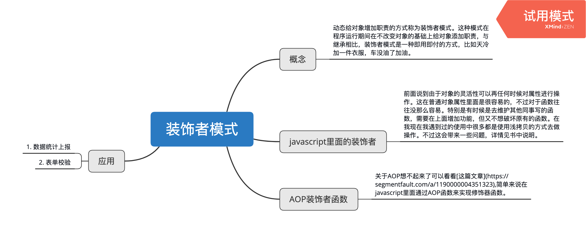

# 装饰者模式
在传统面向对象语言中，给对象添加属性往往是使用继承的方式，在javascript中由于对象的灵活性可以随意添加删减属性。如果使用的继承过多可能会导致超类和子类之间存在强耦合性，超类改变子类也要随之改变。另外，继承这种功能复用方式通常被称为“白箱复用”，也就是是说超类的内部细节相对子类来说是可见的，继承通常被认为破坏了封装性。假设现在有三种型号的自行车，要为每辆自行车安装车头灯，尾灯和铃铛。如果使用继承的方式，那么势必要生成9个子类。如果把这些对象动态组合到自行车上，则只需要增加3个子类。
> 这种动态给对象增加职责的方式称为装饰者模式。这种模式在程序运行期间在不改变对象的基础上给对象添加职责，与继承相比，装饰者模式是一种即用即付的方式，比如天冷加一件衣服，车没油了加油。

## javascript里面的装饰者
前面说到由于对象的灵活性可以再任何时候对属性进行操作。这在普通对象属性里面是很容易的，不过对于函数往往没那么容易。特别是有时候是去维护其他同事写的函数，需要在上面增加功能，但又不想破坏原有的函数。在我现在我遇到过的使用中很多都是使用浅拷贝的方式去做操作。不过这会带来一些问题，详情见书中说明。

## AOP装饰函数
关于AOP想不起来了可以看看[这篇文章](https://segmentfault.com/a/1190000004351323),简单来说在javascript里面通过AOP函数来实现修饰器函数。

```javascript
/* 构造beforeFn和afterFn两个AOP函数，用来给函数进行包装之前的额外操作和包装之后的额外操作 */
(Function as any).prototype.before = function(beforeFn) {
    const _self = this;
    return function() {
        beforeFn.apply(this, arguments);
        return _self.apply(this, arguments);
    }
}

(Function as any).prototype.after = function(afterFn) {
    const _self = this;
    return function() {
        const ret = _self.apply(this, arguments);
        afterFn.apply(this, arguments);
        return ret;
    }
}

document.getElementById = (document.getElementById as any).before(function() {
    console.log('按钮修饰', arguments);
})

const button = document.getElementById('button');

console.log(button);

/* 以上的写法会污染原型，所以可以做一种变通的方式不用绑定在原型上面 */
const before = function(fn, beforeFn) {// 修饰函数
    return function() {
        beforeFn.apply(this, arguments);
        return fn.apply(this, arguments);
    }
}

let at = function() {
    alert('我是原本的函数要弹出at');
}

at = before(at, function() {
    alert('我是在at弹出前修饰at函数的function');
})

at();
```

## AOP应用实例
AOP在应用层面都可以让我们把行为依照职责分成颗粒度更细的函数，随后通过装饰者把它们合并到一起，有助于编写一个松耦合高复用的系统

### 1. 数据统计上报
一般项目代码中都需要分离业务代码和统计代码，都是AOP的经典运用之一。如果在结尾使用这些功能很可能会被迫去修改之前的函数，或者是在函数里面去耦合其他的功能。
```javascript
const after = function(fn, afterFn) {
    return function() {
        const res = fn.apply(this, arguments);// 先执行原函数，在执行修饰函数
        afterFn.apply(this, arguments);
        return res;
    }
}

let showLogin = () => {
    console.log('打开登录浮窗');
}

const log = function() {
    console.log(`上报登录次数`)
}

showLogin = after(showLogin, log);

document.getElementById('button').onclick = function() {
    showLogin();
}
```

### 2. 表单提交校验
表单提交ajax请求的时候需要校验参数，像现在使用antDesign里面的提交函数一般的使用方式就是使用this.props.form.validate去校验，然后在里面在写上提交的函数。其实尽管校验的逻辑封装在了antd的表单里面，但是我们在提交函数里面又去获取了他的计算结果去做判断。那么这里可以使用修饰器将这两个业务完全的解耦。
```javascript
/* 分离表单值校验与提交两个逻辑通过修饰器去添加提交逻辑的方法 */

const form = document.getElementById('form');
const formValue = form.elements;
const submitBtn = document.getElementById('submitBtn');
const serilizeForm = {};
function validateForm() {
    for(let i = 0,formItem;formItem = form[i++];) {
        serilizeForm[formItem.name] = formItem.value;
    }
    console.log('校验值',serilizeForm);
    if (serilizeForm.decUsername === '') {
        alert('用户名不能为空');
        return false;
    }
    if (serilizeForm.decPassword === '') {
        alert('密码不能为空');
        return false;
    }
}

Function.prototype.validate = function(validateFn) {
    const _self = this;
    return function() {
        if (validateFn.apply(this,arguments) === false) {
            //校验不通过的情况直接返回不再执行
            return;
        }
        return _self.apply(this,arguments);
    }
}

let formSubmit = function() {
    const param = {
        ...serilizeForm
    }
    console.log('正在发送ajax请求,参数',param);
}
//修饰类校验提交信息是否准确
formSubmit = formSubmit.validate(validateForm);

submitBtn.onclick = function() {
    formSubmit();
}
```


