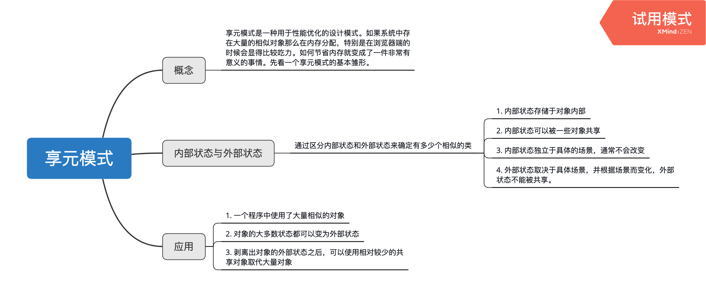

# 享元模式
享元模式是一种用于性能优化的设计模式。如果系统中存在大量的相似对象那么在内存分配，特别是在浏览器端的时候会显得比较吃力。如何节省内存就变成了一件非常有意义的事情。先看一个享元模式的基本雏形。

##  生产内衣模特的例子
假如一个工厂需要用服装模特给500件男士内衣和500件女士内衣打广告。显然我们不需要真的生产1000个模特给每件内衣使用，一个男模特和女模特就可以穿上不同的男士内衣和女士内衣，然后拍照就可以。也就是说不需要这么多的相似的对象，下面来看一下实现方式。

```typescript
// 定义模特类
class Model {
    underwear: string;

    constructor(readonly sex: string) {
        this.sex = sex;
    }

    takePhoto() {
        console.log(`sex=${this.sex} underwear ${this.underwear}`);
    }
}


const man = new Model('man');
const female = new Model('female');

// 给男士内衣拍照
for(let i = 0; i< 50; i++) {
    man.underwear = 'underwear' + i;
    man.takePhoto();
}

// 给女士内衣拍照
for(let i = 0; i < 50; i++) {
    female.underwear = 'underwear' + i;
    female.takePhoto();
}
```

## 内部状态和外部状态
享元模式要求将对象的属性划分为内部状态和外部状态，享元模式的目标时尽量减少共享对象的数量，书中总结的划分对象状态的几条经验
```
1. 内部状态存储于对象内部
2. 内部状态可以被一些对象共享
3. 内部状态独立于具体的场景，通常不会改变
4. 外部状态取决于具体场景，并根据场景而变化，外部状态不能被共享。
```
在上面的例子中，性别就是内部状态，内衣是外部状态。区分出了有两种内部状态就能确定可以只有两个类对象。而衣服需要更具具体的场景来确定他的状态，比如男士内衣用于男士，女士内衣用于女士。这种情况就应该划分在外部状态。


## 文件上传的例子
现在假设有一个文件上传的功能，包含两种上传文件的方式。在上传文件的时候需要知道文件的名称和大小。那么把每个上传文件都看成一个对象的话它就需要包含上传方式、文件名称、文件大小、文件路径等等。如果这样那么上传文件数量非常多的时候，文件就会很多。运用享元模式就需要提取出内部状态和外部状态，找到对象的相似性。减少上传对象数量的传递。经过上传条件的明确，上传文件属性可以提出作为内部状态。

```javascript
/* 享元模式重构文件上传 */

// 首先需要分离和确定内部状态和外部状态，upload构造函数确定为内部状态，包括uploadtype
const Upload = function(uploadType) {
    this.uploadType = uploadType;
};

Upload.prototype.delFile = function(id) {
    // 给upload设置外部状态的正确的filesize的大小
    uploadManager.setExternalState(id, this);
    if (this.fileSize < 3000) {
        return this.dom.parentNode.removeChild(this.dom);
    }
    if (window.confirm('确定要删除该文件吗？' + this.fileName)) {
        return this.dom.parentNode.removeChild(this.dom);
    }
};

const UploadFactory = (function() {
    const createdFlyWeightObjs = {};
    return {
        create: function(uploadType) {
            if (createdFlyWeightObjs[uploadType]) {
                return createdFlyWeightObjs[uploadType];
            }
            return (createdFlyWeightObjs[uploadType] = new Upload(uploadType));
        },
    };
})();

// 封装管理器的外部状态
const uploadManager = (function() {
    const uploadDataBase = {};
    return {
        add: function(id, uploadType, fileName, fileSize) {
            const flyWeightObject = UploadFactory.create(uploadType);
            const dom = document.createElement('div');
            dom.innerHTML = `
                <span>文件名称：${fileName},文件大小：${fileSize}</span>
                <button class="delFile">删除</button>
            `;
            dom.querySelector('.delFile').onclick = function() {
                flyWeightObject.delFile(id);
            };
            document.body.appendChild(dom);

            uploadDataBase[id] = {
                fileName,
                fileSize,
                dom,
            };
            return flyWeightObject;
        },
        setExternalState: function(id, flyWeightObject) {
            const uploadData = uploadDataBase[id];
            for (let i in uploadData) {
                flyWeightObject[i] = uploadData[i];
            }
        },
    };
})();

let id = 0;

window.startUpload = function(uploadType, files) {
    for (let i = 0, file; (file = files[i++]); ) {
        const uploadObj = uploadManager.add(++id, uploadType, file.fileName, file.fileSize);
    }
};

startUpload('plugin', [
    {
        fileName: '1.txt',
        fileSize: 1000,
    },
    {
        fileName: '2.html',
        fileSize: 2000,
    },
    {
        fileName: '3.txt',
        fileSize: 3000,
    },
]);

startUpload('flash', [
    {
        fileName: '4.txt',
        fileSize: 1000,
    },
    {
        fileName: '2.html',
        fileSize: 3000,
    },
    {
        fileName: '3.txt',
        fileSize: 5000,
    },
]);
```

> 由此可见享元模式是一种很好的性能优化方案，但是它也会带来一些复杂性的问题，使用享元模式之后会多出一些需要维护的东西，在不需要享元模式的场景下这些开销是可以避免的

一般来说如下场景可以使用享元模式
``
1. 一个程序中使用了大量相似的对象
2. 对象的大多数状态都可以变为外部状态
3. 剥离出对象的外部状态之后，可以使用相对较少的共享对象取代大量对象
``
