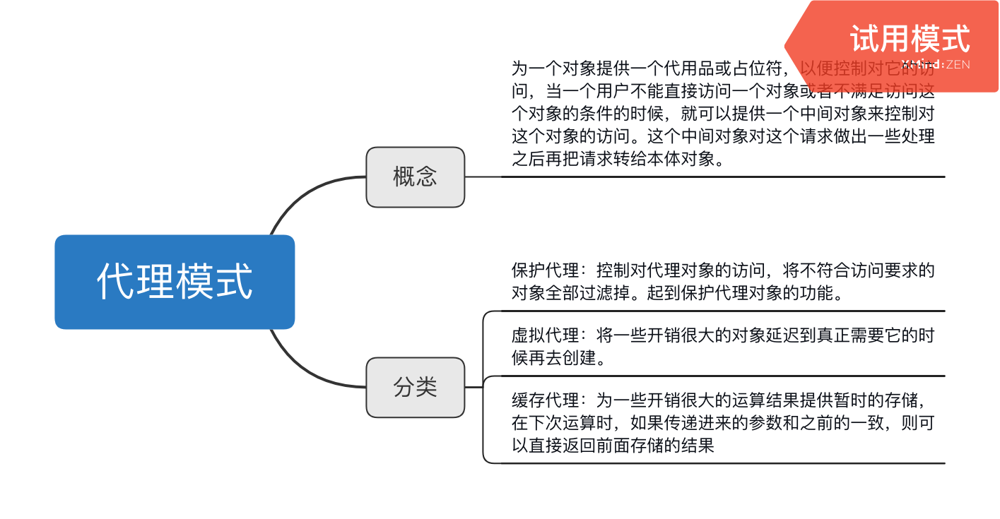

## 缓存代理
缓存代理可以为一些开销大的运算结果提供暂时的存储，下次运算时，如果传递进来的参数一致则可以直接返回结果。

```typescript
const createProxyFactory = function(fn:Function): Function {// 后面添加一下泛型的概念
    const cache = {};
    return function(): any {
        const args = Array.prototype.join.call(arguments,',');
        if (args in cache) {
            return cache[args];
        }
        // 这里将返回值cache[args]的具体值和给cache赋值的操作结合在了一起
        return cache[args] = fn.apply(this,arguments);
    }
}

const mult = function() {
    let a = 1;
    for(let i = 0,l = arguments.length; i < l;i++) {
        a = a * arguments[i];
    }
    return a;
}

const plus = function() {
    let a = 1;
    for(let i = 0,l = arguments.length; i < l;i++) {
        a = a + arguments[i];
    }
    return a;
}

const proxyMult = createProxyFactory(mult);
const proxyPlus = createProxyFactory(plus);

alert(proxyMult(1,2,3,4));
alert(proxyMult(1,2,3,4));
```

