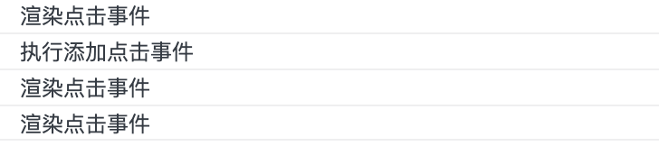
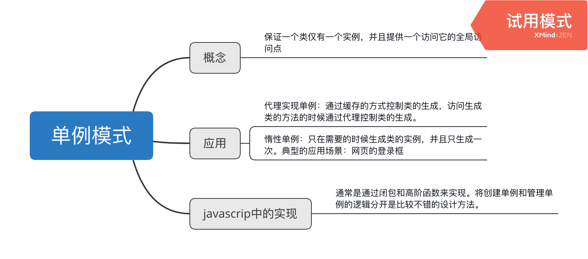

## 惰性单例
下一个例子，惰性单例。``所谓惰性单例，就是对象实例只在需要的进行创建或者加载，并且只创建一个实例对象。``
一个典型的应用场景就是页面登录的modal框。回想自己之前做的这种功能都是在页面渲染后先加载出modal框然后隐藏起来，在点击的时候打开，然后在关闭，第二次点击又加载又关闭，如此循环往复，这样的做法显然是不合理的。采用惰性加载的方式就是需要在创建的时候做个判断，是否已经创建过该对象，有就直接加载。
想起之前thoughtworks出的那份作业里面就有这样的一个对话框需要封装，当初就是采用很原始的那种做法，以至于结对编程环节没能快速的实现需求。
```typescript
// 管理创建单例的方法，如果已经创建过相应的单例那么直接 返回，否则创建单例
const getSingle = (fn: Function): Function => {
    let isCreated: any;
    return function() {
        return isCreated || (isCreated = fn.apply(this, arguments));
    };
};

// 创建节点
const createDiv = (): HTMLElement => {
    const div = document.createElement('div');
    div.innerHTML = '登录浮窗';
    document.body.append(div);
    div.style.display = 'none';
    return div;
}

// 创建登录框的单例类
const getLoginSingleLayer = getSingle(createDiv);
// 打开登录浮窗
document.getElementById('loginBtn').onclick = function() {
    const loginLayer = getLoginSingleLayer();
    loginLayer.style.display = 'block';
}
// 退出登录浮窗
document.getElementById('logoutBtn').onclick = function() {
    const loginLayer = getLoginSingleLayer();
    loginLayer.style.display = 'none';
}
```
重新写完这个例子我又有了不一样的感受，原来用这种方式去创建这种只生成一次的实例是如此高效。并且在关闭的时候因为只有一个，所以只用去找最初创建的那个实例就可以了。

### 事件绑定
另一个例子是事件绑定的。以前通过事件代理优化节点事件的绑定次数，这里也可以使用单例模式实现同样的效果。
```typescript
// exp2
//事件绑定
const bindEvent = (): Boolean => {
    const div1 = document.getElementById('div1');
    div1.addEventListener('click',function() {
        alert('添加点击事件');
    })
    return true;
}

const isBindEvent = getSingle(bindEvent);

const renders = (): void => {
    console.log('渲染点击事件');
    isBindEvent();
}
// 可以看到执行了三次绑定函数但是只绑定了一次事件
renders();
renders();
renders();
```


## 总结
单例模式的概念很简单，书中用常规开发中的两个例子来进行讲解让人深刻的理解了单例模式在实际开发中的使用场景。特别是将创建对象和管理单例的职责分开来写在了不同的地方，这种细致的解耦大大的提升了代码的可维护性。

