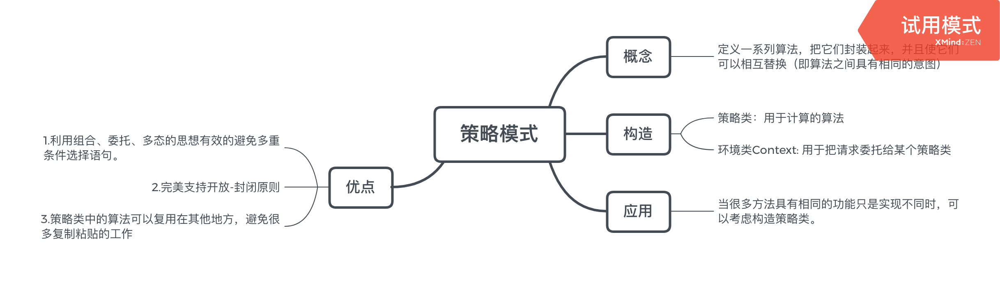

# 表单校验
表单校验是很常用的功能，单独拆分来写它的这个校验功能的话也是策略模式的写法。首先来构造校验的策略对象。
```typescript
interface IformStrategies {
    isNonEmpty: (value: any,errorMsg: string) => string;
    minLength: (value: string, length: number, errorMsg: string) => string;
    isMobile: (value: string, errorMsg: string) => string;
}

const strategies: IformStrategies = {
    isNonEmpty: (value,errorMsg) => {
        if (value === '') {
            return errorMsg;
        }
    },
    minLength: (value,length,errorMsg) => {
        if (value.length > length) {
            return errorMsg;
        }
    },
    isMobile: (value,errorMsg) => {
        if (!/^1[3|4|5|7|8|9][0-9]{9}$/.test(value)) {
            return errorMsg;
        }
    }
}
```
先定义好一组校验的策略方法，将他们封装在对象里面。接下来定义访问策略的context类
```typescript
// 实现Validator类
class Validator {
    cache: Array<Function> = [];// 保存校验规则

    add(dom: HTMLInputElement,rule: string,errorMsg: string): void {
        const ary = rule.split(':');// 将规则名称和校验所填的参数分割开来
        this.cache.push(function() {// 将一系列的规则校验放到cache里面
            const strategy = ary.shift();// 取出strategy
            ary.unshift(dom.value);// 获取表单元素的值
            ary.push(errorMsg);// 放入错误提示信息到最后
            return strategies[strategy].apply(dom,ary);
        })
    }
    start():string | undefined {
        for(let i = 0,validatorFunc;validatorFunc = this.cache[i++];) {
            const msg = validatorFunc();
            if (msg) {// 如果有确切的返回值，则返回错误提示
                return msg;
            }
        }
    }
}
```
这里有两个地方我觉得写得很有技巧。第一个是将传入的校验规则分割成数组，始终将表单的值和错误信息放到校验数组的第一个和最后一个已满足策略对象里面参数的形式。校验的时候通过apply将校验方法的执行对象绑定到每个表单上去，这是以前做的时候没有这样写过的。

然后添加表单的校验函数
```typescript
const registerForm: any = document.getElementById('registerForm');
const validateFunc = () => {
    const validator = new Validator();
    validator.add(registerForm.username,'isNonEmpty','用户名不能为空');
    validator.add(registerForm.password,'minLength:6','密码长度不能少于6位');
    validator.add(registerForm.phoneNumber,'isMobile','手机号码格式不正确');
    const err = validator.start();
    return err;
}
registerForm.onsubmit = function(e) {
    e.preventDefault();
    const errorMsg = validateFunc();
    console.log(errorMsg)
    if (errorMsg) {
        alert(errorMsg);
        return false;// 校验不通过阻止表单提交
    }
}
```
这样就通过几个配置就配置出了表单的校验，后面还有要增加的策略就只用添加策略对象里面就可以了。

# 总结
在JavaScript中使用函数对象去替换传统面向对象语言里面的策略类，可以说是更加的简便一些。对于策略模式的使用也早有接触，现在明白了在构造策略模式上需要系统的去设计哪些东西。好好运用这个模式能够更好的明白使用函数的好处。

