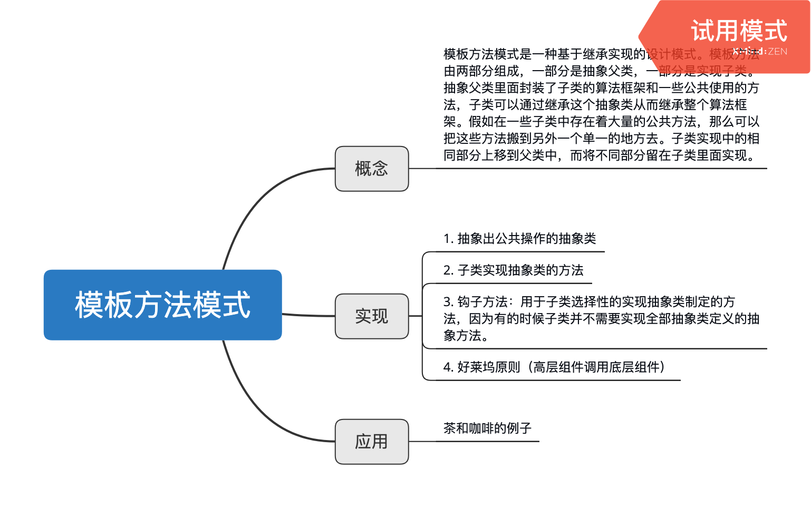

# 模板方法模式

> 模板方法模式是一种基于继承实现的设计模式。模板方法由两部分组成，一部分是抽象父类，一部分是实现子类。抽象父类里面封装了子类的算法框架和一些公共使用的方法，子类可以通过继承这个抽象类从而继承整个算法框架。假如在一些子类中存在着大量的公共方法，那么可以把这些方法搬到另外一个单一的地方去。子类实现中的相同部分上移到父类中，而将不同部分留在子类里面实现。

## 咖啡和茶的例子

**一般泡咖啡需要通过以下的步骤实现**

```
1. 把水煮沸
2. 用沸水冲泡咖啡
3. 把咖啡倒进杯子
4. 加糖和牛奶
```
**泡茶也是同样的步骤**

```
1. 把水煮沸
2. 用沸水冲泡茶叶
3. 把茶水倒进杯子
4. 加柠檬
```

> 两者对比可以发现，冲泡咖啡和茶的步骤是一样的，不同的是两者在配置的时候所用的调料不同而已。那么我们就可以把这两个相同的地方分离出来。现在实现代码。需要说明的是，模板方法模式依赖抽象类的实现，这里使用ts里面的抽象类就能很好的实现。

```typescript
/**
 *茶和咖啡的例子
 *
 */

// 饮料抽象类，包含包含各种饮料制作的方法
/**
 *茶和咖啡的例子
 *
 */

// 饮料抽象类，包含包含各种饮料制作的方法
abstract class Beverages {
    boilWater() {
        console.log('把水煮沸');
    }
    abstract brew(): void; // 浸泡种类
    abstract pourInCup(): void; // 把饮料倒进杯子里，具体到哪种饮料有继承类实现
    abstract addCondiments(): void; // 添加佐料，具体哪种由继承类实现
    customAddConimentsHook() {
        // 判定是否添加糖和牛奶的钩子,默认添加
        return true;
    }
    init() {
        this.brew();
        this.pourInCup();
        if (this.customAddConimentsHook()) {
            this.addCondiments();
        }
    }
}

// 创建咖啡类
class Coffees extends Beverages {
    brew() {
        console.log('用沸水浸泡咖啡');
    }
    pourInCup() {
        console.log('把咖啡倒进杯子');
    }
    addCondiments() {
        console.log('加糖和牛奶');
    }
    customAddConimentsHook() {
        return window.confirm('是否添加糖和牛奶');
    }
}

const cof = new Coffees();
cof.init();

// 创建茶类
class Teas extends Beverages {
    brew() {
        console.log('用沸水浸泡茶叶');
    }
    pourInCup() {
        console.log('把茶倒进杯子');
    }
    addCondiments() {
        console.log('加柠檬');
    }
}

const teas = new Teas();
teas.init();

```

> 这里的模板方法就是抽象类里面的init方法，因为在这个方法里面封装了子类算法的框架，它作为一个算法的模板指导子类以何种顺序去执行哪些方法。

## 钩子方法
上面的茶和咖啡的例子实现了从抽象类继承在子类中必须实现的方法。不过有时候我们并不是每个方法都要执行，比如有的咖啡可以不放糖和牛奶。在面对这种不同的需求的时候可以引入钩子方法来控制抽象方法的执行。钩子方法已添加在上面代码中。

## 好莱坞原则
这里有一个设计原则中的体现，那就是好莱坞原则。“不要调用我们，我们来调用你。”子类只需要按照抽象类规定好的方式去实现里面的方法即可。不需要询问什么时候能执行。和发布-订阅以及回调函数的原则一样。


## 小结
模板方法模式是一种典型的封装变化的设计模式，把变化的内容放在抽象类里面，然后在子类里面去进行方法扩展给系统增加新的功能而不需要去改动抽象类。这也是比较符合开放-封闭原则的。

==不过在javascript中，由于函数的灵活性，通常可以通过高阶函数快速的实现而不需要依照传统的类来实现。==





